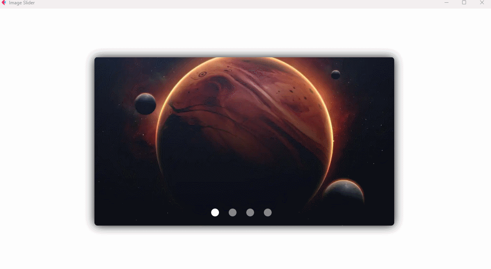

### 用 Python + Flet 制作的轮播图效果，通过点击不同的按钮来切换不同的图片

设计来源：

[Python Flet Image Slider Tutorial | Create a Modern Carousel UI](https://www.youtube.com/watch?v=Vbu1UAaoJxw)

### 效果




### 使用方法

### 1. 安装 flet
```commandline
    pip install "flet[all]"
```

### 2. 运行
```commandline
    flet run main.py
```
或者 

直接在 pycharm 中运行 main.py 文件

### 其他

点击 不同的按钮 就可以切换不同的图片
